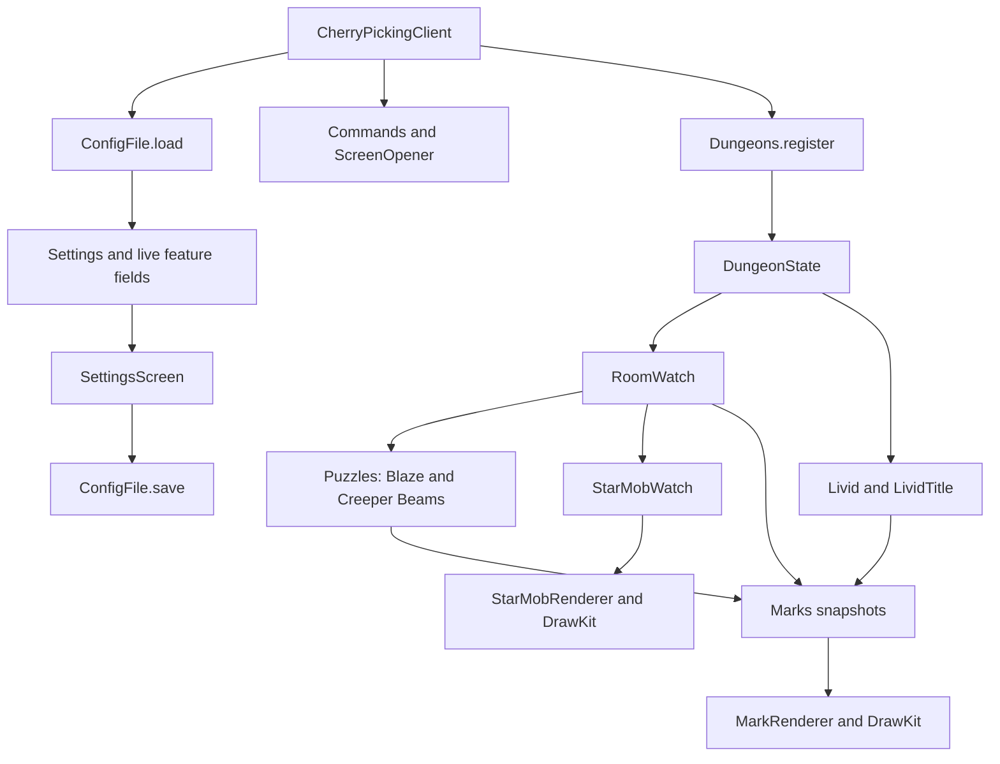

# Architecture

Current implementation audited on **2026-09-22**, including the existing uncommitted work.
This is an implementation map, not a claim that every feature has passed in-game verification.
See [modernization-plan.md](modernization-plan.md) for evidence, priorities and the next task.

## Scope and documentation

CherryPicking is a client-only Fabric mod for Minecraft 26.2. It displays dungeon guidance and
provides a custom settings screen. It does not automate movement, attacks, interactions or player
chat. Features announce locally through `client.dungeon.Chat`; it does not send `/locraw`.

- [CLAUDE.md](../CLAUDE.md) contains development instructions, including display-only behavior,
  code-quality and verification rules, stable settings keys, optional integrations and real-client
  testing. `AGENTS.md` is a symlink to it, so Codex reads the same file.
- [dungeon-layer.md](dungeon-layer.md) preserves detailed design rationale and upstream research.
  Its original feature list and stages mix implemented and future work. It is not a release list.
- [in-game-checks.md](in-game-checks.md) owns player verdicts. Historical checks remain intact even
  when a subsequent change replaces the behavior they describe.
- [future-work.md](future-work.md) covers miniboss detection without nametags.
- [friend-cosmetics-plan.md](friend-cosmetics-plan.md) is a separate, unimplemented proposal.

## Runtime composition



`CherryPicking` holds the mod ID, logger and identifier helper. `CherryPickingClient` is the only
client initializer. It loads config **before** registering tick callbacks or commands. It then
registers deferred screen opening, client commands, and the single `Dungeons.register()` call.
The empty data-generator entrypoint is scaffolding, not a gameplay subsystem.

`Dungeons.register()` registers end-of-client-tick callbacks in this order: `DungeonState`,
`RoomWatch`, `Puzzles`, `Livid`, `StarMobWatch`. It also installs puzzle signatures, world-render
callbacks and the Livid HUD element. Ordering matters: consumers use the gate and room state from
the same tick. Registration is explicit; there is no discovery framework for features.

## Settings, persistence and screen

| Component | Responsibility and extension boundary |
| --- | --- |
| `client.config.Settings` | Ordered registry of 44 settings and two reset actions at the audit. Captures owner-field defaults during class initialization. `all()` includes actions; `settings()` excludes them. |
| `Setting<T>` | Stable key, label, description, section, typed control, captured default and live getter/setter. Does not own a second value or validate it. |
| `Control<T>` | Sealed flag, whole number, real number, enum choice and colour descriptions. Widget switches are exhaustive. Numeric limits currently constrain widgets; owner setters are responsible for other entry paths. |
| `Entry`, `Action`, `Section` | Settings/actions share screen metadata; nested dependencies disable rows; enum declaration order controls tabs/groups. Actions have no persisted value. |
| `ConfigFile` | Fabric config-directory adapter plus JSON decoding, migration, encoding and direct file writes. A malformed document logs and leaves defaults; individual conversion failures leave that setting unchanged. |
| `ConfigScreen.build(parent)` | Common factory used by commands, ModMenu and the hub. Returns the mod's own `SettingsScreen`, with no YACL dependency. |
| `ScreenOpener` | Defers `/cherry` and `/cherry config` until chat has closed and no screen is open. |
| `client.screen` | Registry-driven rail, card grid, search, widgets, dropdowns, colour picker, scrolling, tooltips and reset controls. Helpers are mostly package-private; `ScreenSettings` exposes appearance preferences. |

Values take effect immediately; this screen has no transactional Cancel behavior. Done/Escape
save and return to the parent. Picker and dropdown commits and reset operations also save.
Ordinary flag/slider changes are saved on close. `SettingsScreen` does not override `removed()`;
saving after an external screen replacement is not established. Escape closes a popover first,
then clears a search, then closes the screen. Reset all requires a second click; reset shown/tab
operates on the current cards. The screen does not pause the world.

Persistence contracts:

- File: Fabric's config directory plus `cherrypicking.json`; flat JSON object with stable keys.
- Missing keys keep defaults at startup; unknown keys are ignored on load and omitted on save.
  Preserving arbitrary unknown keys or downgrade round-tripping is not an existing guarantee.
- Choices save **enum names**, not labels or ordinals. Renaming enum constants is a config change.
- Swatches accept named colours (`green`), named alpha (`green@80`), RGB/ARGB hex
  (`#40a02b`, `#ff40a02b`), and optional independent fill (`/59`). Serialization omits default
  alpha/fill suffixes. Named colours follow the theme; literal colours retain their RGB.
- Legacy `boxes.fillOpacity` is applied to saved box-colour values without an explicit `/xx`:
  `fill = round(outlineAlpha * clamp(legacyShare, 0, 1))`. It is omitted on the next save.
  This migration currently does not visit absent colour keys or `beams.fillAlpha`.
- Removed `general.placeholder`, `livid.hud.*` and `mobs.opacity` are not current settings;
  existing docs explicitly describe dropping retired values. Do not restore retired features
  as a side effect of modernization.

The current file writer is not atomic. Invalid numeric data is not consistently rejected or
bounded across all entry paths. These are planned repairs, not properties to depend on.

## Themes and resources

`Flavour` maps 26 saved enum choices to resource keys and display labels: four Catppuccin flavours
and 22 additional editor themes. `Palettes` lazily reads `assets/cherrypicking/theme/themes.json`
from the classpath and caches all palettes. Each supplies the same 26 named slots. Missing or
malformed flavours fall back to built-in Latte. `Role` maps UI functions to slots; `Theme`
resolves the live flavour/accent and independent outline/fill colours. Defaults are Latte/Mauve.

Screen and mob colours resolve while drawing; puzzle/Livid marks store resolved colours when
published. Developer room marks can retain their resolved colour until republished. Thus the
comment in `Theme` promising universal next-frame recolouring is broader than the implementation.
These bundled resources are classpath data, not a resource-pack reload API.

`Solutions` lazily caches the Creeper Beams file, tolerates bad rows, and falls back to an empty
solution on failure. The bundled file contains 13 six-integer rows, including one duplicate.
The solver deduplicates by the first endpoint. `List<int[]>` is shallowly immutable; callers must
not mutate its arrays. There is no current Water Board, Boulder or Teleport Maze dataset.

## Dungeon state and detection

| Component | Current behavior | Important limit |
| --- | --- | --- |
| `DungeonState` | Reads sidebar every 20 client ticks; checks boss position each tick. Publishes Catacombs, floor/master, boss, sidebar and a generation counter. Developer override can force the gate. | A SKYBLOCK sidebar title is required normally. Current shared mode and a Catacombs sidebar line are ORed; contradictory mode is not a veto. |
| `SharedLocraw` | Reads `coalroutegenerator:locraw`, a JDK map with string fields and epoch-millisecond `receivedAt`. Rejects replies older than local world invalidation. Missing/malformed share yields empty mode. | World replacement invalidates the share but does not immediately clear all sidebar/floor state or necessarily advance dungeon generation. |
| `ScoreboardReader` | Builds visible team-decorated sidebar lines in descending score order, strips formatting/control characters, excludes hidden/blank entries. | Server text is a heuristic input; no recorded-input test corpus exists. |
| `RoomWatch` | Maps player position to a 6×6 grid of 32-block tiles; flood-fills across seam probes; tries four rotations against registered signatures in single-tile rooms. | Up to nine attempts seven ticks apart. Unloaded columns count as empty. A resolved frame or exhausted retries stops probing. It does not identify arbitrary room names. |
| `RoomFrame`, `Rotation` | Convert room-relative x/z to world coordinates and back; y stays absolute. | Preserve the anchor conventions documented in dungeon-layer §3.1. |

Normal boss thresholds exist for F1–F6 (also used for the corresponding master floors). F7/M7
has no boss rule and logs that fact; the entrance has no numbered floor. Do not imply full boss
gating coverage. Room shape changes during retries currently update `roomTiles` without advancing
room generation; evaluate consumer expectations before changing that contract.

## Gameplay features

- **Blaze:** frameless solver filtered to the current room. Re-reads named stands, parses maximum
  health, sorts with an entity-ID tie breaker and highlights upcoming targets. Auto order probes
  for a chest; manual order remains available. Unknown order gives neutral boxes. Optional lines,
  local completion message and reset action are registered settings. A one-to-zero stand count
  currently marks completion; disappearance alone does not prove a kill.
- **Creeper Beams:** signature-based frame detection, paired lit-lantern boxes and optional lines,
  palette cycle with separate outline/fill opacity. Re-probes both endpoints so teammate progress
  is observed. Completion is a seen-air-to-chest transition. Reset clears visit state.
- **Livid:** F5/M5 boss-only detection from changes at two wool positions, with a two-second
  blindness fallback. Locks the first identity for that fight. Publishes a moving entity box,
  local colour/name announcement and optional `LividTitle`. Resets on level identity separately
  from dungeon generation so crossing the boss door does not discard fight evidence.
- **Livid title:** separate HUD element, configured hold time plus 500 ms fade, hidden by F1/F3.
  The old invulnerability timer was intentionally removed. Timing uses wall-clock milliseconds.
- **Starred mobs:** every four ticks, rereads starred nametag stands in the current room; guesses
  owner ID and falls back to a nearby qualifying mob. Excludes version-4-UUID players; caps the
  snapshot at 64 mobs. Optional hidden-Fels mode boxes invisible Endermen without requiring a
  star and defaults off. Labels include distance. Distant miniboss detection still needs a
  stand; the player-reported loss beyond roughly 20 blocks is recorded in `future-work.md`.

`Puzzles` owns the two solver instances, signatures, polling counters and joined marks.
`Puzzle.entered`, `tick`, `left`, `reset` and `marks` define the lifecycle. A signature-free solver
runs in each room and identifies its own inputs. `left()` normally resets; a future solver may
retain run-scoped progress. Disabling the master stops/resets both solvers; individual disable
setters currently reset their own state. Do not assume every feature has identical reset semantics.

## Rendering and ownership

Detection and config application run on the client thread. Features publish complete `Marks`
lists through volatile references. `Mark` is a sealed set of static box, entity box, line, tracer
and label descriptions. Static boxes are meshed at publication; moving boxes resolve entity IDs
and interpolate positions during rendering. `MarkRenderer` has explicit sources for room debug,
Livid and puzzles. Its terrain policy is source-specific.

`StarMobRenderer` intentionally remains separate: it orders mobs far-to-near and uses per-mob
submit orders, different shading and name/distance labels. It shares `DrawKit`, `BoxMesh` and
`CherryRenderTypes`. Merging it with the generic renderer would need to preserve those behaviors.

`CherryRenderTypes` lazily creates graphics pipelines once the device exists. Lines use the
bundled no-fog fragment shader; quads use vanilla snippets. Depth-tested variants serve puzzle
settings; other sources draw through terrain. Tracers always bypass terrain; labels use the
name-tag submission path. Compilation does not validate shader execution or GPU appearance.

The snapshot convention is valuable but not deep immutability everywhere: `BoxMesh` exposes
arrays and `StarMobWatch.mobs()` returns its published array. Several related dungeon fields are
independent volatiles, not one coherent snapshot. No race or external mutation was reproduced;
thread-affinity assumptions need verification before adding synchronization or background scans.

## Optional integration and shutdown

- `/cherry` and `/cherry config` work independently of other mods.
- `ModMenuHooks` is the sole ModMenu API adapter; ModMenu is compile-only and suggested metadata.
- `HubEntry` implements `Function<Screen, Screen>` under `jeffhub`, honours the parent and always
  constructs the native screen. It imports no sibling or optional UI types. The additive contract
  is owned by [the flipper hub document](../../skyblock-flipper-26.2/docs/config-hub.md).
- Coalroutegenerator supplies optional shared location data. Its
  [contract](../../coalroutegenerator-26.2/CLAUDE.md#shared-locraw) is consumed without imports.
  With that mod absent, detection uses the sidebar alone.
- `ShutdownWatchdogMixin` injects at the tail of `ClientShutdownWatchdog.startShutdownWatchdog`.
  Only the `post-main` name calls `CleanExit.afterMain()`. The default-on `quitting.cleanExit`
  setting controls logging lingering non-daemon threads and calling `System.exit(0)`.
  This is a process-lifecycle compatibility feature, not a dungeon feature. Its comments about
  other mods and normal/crash paths are rationale, not fresh runtime verification.

## Build and extension workflow

The Gradle wrapper is 9.5.1. The build requests Loom `1.17-SNAPSHOT` (the audit's cache resolved
1.17.21), JDK/release 25, Minecraft 26.2, Loader 0.19.5, Fabric API 0.160.0+26.2 and compile-only
ModMenu 20.0.1. Metadata declares Minecraft `~26.2`, Java `>=25`, Loader `>=0.19.5` and Fabric API
`*`; successful compilation against pinned versions does not certify every permitted combination.

`jar` is the shipped artifact. `build` is finalized by `installMod`, which copies into the user's
macOS Minecraft mods directory when present. The destination includes the version
(`cherrypicking-1.0.0.jar` today), so a later version can leave an older jar installed.
CI runs `build` on Ubuntu/JDK 25 and uploads `build/libs`; the Mac-specific destination normally
does not exist there. There is no test source tree or configured test library at this baseline.

For verification without installing:

```bash
JAVA_HOME=/Library/Java/JavaVirtualMachines/temurin-25.jdk/Contents/Home \
  ./gradlew build -x installMod --offline --rerun-tasks --console=plain
```

This was verified with the local dependency cache; a cold checkout needs dependency resolution.
The real Minecraft client on Hypixel is the supported manual test route. Do not substitute
`runClient` or `run/` for those checks.

For a new tunable, add a live owner field/getter/setter and registry entry with a stable key,
captured default and plain description. For a new puzzle, add its implementation and `Puzzles`
registration, signatures if needed, settings, optional validated data and lifecycle/behavior tests.
Use existing marks; add a mark kind only for a real rendering requirement. A new theme needs a
stable `Flavour` constant and all resource slots. New optional integrations stay behind narrow
adapters. No shared library, event framework or dependency-injection framework is required by
the current extension paths.
